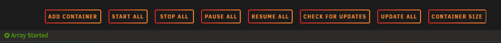
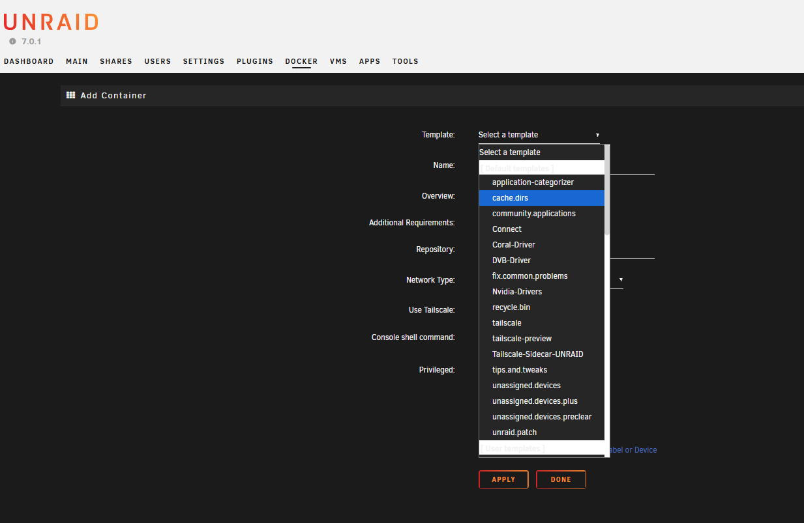

# Unraid Templates

Unraid templates can usually be found at the below path:

```bash
/boot/config/plugins/dockerMan/templates-user/
```

Each template usually has the prefix of `my-`, one day I'll look up why 🙂

Once you have added a tmeplate here, you can access your Unraid server, go to the Docker tab and at the bottom select **ADD CONTAINER**


You'll be greeted with a form, at the top being a drop down menu for you to select from your list of templates


Once you choose a template, if there are any environment variables you should be able to set them, then select **APPLY** at the end of the form
